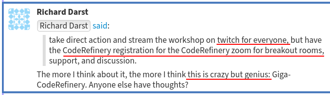

class: center, middle, inverse

## Tech Talk, Oct 28, 2021

# Next steps to FAIRifying coding in an academic setting

## Radovan Bast [@\_\_radovan](https://twitter.com/__radovan)

Nordic e-Infrastructure Collaboration/
UiT The Arctic University of Norway

---

.cite["A FAIRer future" Nat. Phys. 15, 728–730 (2019), https://doi.org/10.1038/s41567-019-0624-3]

---

## About me

.left-column40[

]

.right-column60[
- Theoretical chemist turned research software engineer.
- I write research software and teach programming to researchers and lead the
  [CodeRefinery project](https://coderefinery.org).
- Developing libraries for computational chemistry and computational geometry
  (used in oceanography).
]

---

## CodeRefinery

We teach tools and practices for the
development of reproducible and reusable research software.

.left-column50[

- https://coderefinery.org
- https://coderefinery.org/workshops/past/
]
.right-column50[

]

---

## CodeRefinery

### Our goal

Advance .emph[FAIRness] of software management and development practices so that research groups can
.emph[collaboratively develop], review, discuss, test, share, and reuse their codes.

### History

- Project grew out of a 1-week course started at KTH Stockholm in 2014
- Since 2016:
  - **31 full workshops**
  - 25 other workshops/events
  - 3 instructor training events
  - **over 1600 persons trained** across all academic disciplines
- Last 4 workshops: **8 volunteer instructors**, over **80 volunteer helpers**

### We just got funding for 3 more years 🎉

---

## Typical curriculum

.left-column60[
- Basic and collaborative Git
- Code review
- Social coding and open software
- Reproducible research
- Jupyter notebooks
- Code documentation
- Automated testing
- Modular code development

### All our material is open and CC-BY

- https://coderefinery.org/lessons/
- https://github.com/coderefinery

We are now in the process of making the lessons citable.
]
.right-column40[
### 3 days on-site in person

### Now: 6 half-days online
]

---

## CodeRefinery: bridging the gap

---

## A vision of reaching many people at once

.cite[Twitch: live streaming service popular in the gaming community]

---

## Scaling up during 2020: effective team work

- Before 2020: ~25 participants, ~2 helpers
- Now: routinely 100+ participants, 20+ helpers
- Lectures & code-along exercises in the main room: .emph[stream and also record]
- Get help and group exercises in a breakout room
- Participants can register as teams (.emph["bring your own breakout room"])
- Installation sessions and helper preparation sessions
- Asynchronous Q&A via [HackMD](https://hackmd.io/) ->
  we publish these ([example](https://coderefinery.github.io/2020-10-20-online/#questions-answers-and-feedback))

### More details

- [Operation manuals](https://coderefinery.github.io/manuals/):
  reference and training for our teaching style
- Blog post: https://coderefinery.org/blog/2020/07/31/mega-coderefinery/
- [Presentation at CarpentryCon@Home 2020](https://github.com/coderefinery/carpentrycon-2020)

---

## Recent feedback

> "I take this chance to congratulate once more for the very appreciated workshop.
> I really enjoyed all the sessions, this is something I have been looking for
> for a couple of years now and that I will strongly advertise between my
> colleagues.  In particular, I would like to congratulate you for your
> professionalism and for having made the most of all the potential of distance
> learning, without ever complaining about its obvious and unnecessary
> limitations. The team effort during the classes was impressive. Also, the
> material available to support the classes is excellent and I am sure I will
> exploit it in the future."

---

class: center, middle, inverse

# Who is our community?

# What is our impact?

---

## Pre-workshop survey: Who comes to our workshops?

- https://github.com/coderefinery/pre-workshop-survey
- https://doi.org/10.5281/zenodo.2671578

---

---

## Pre-workshop survey: Programming languages

---

## Pre-workshop survey: Version control

---

## Pre-workshop survey: Tests

---

## Pre-workshop survey: Automated testing

---

## Pre-workshop survey: Documentation

---

## Pre-workshop survey: Web tools

---

## Pre-workshop survey: Code review

---

## Post-workshop survey: impact on usage of tools

- https://github.com/coderefinery/post-workshop-survey
- https://doi.org/10.5281/zenodo.2671576

---

## Post-workshop survey: impact on code quality and collaboration

- 284 answers

---

## RSH

- Research Software Hour: https://researchsoftwarehour.github.io/
- [Research Software Seminar Series](https://nordic-rse.org/events/seminar-series/)

---

class: center, middle, inverse

## Software reproducibility 10-year challenge:

# Try to build **your code** from 10 years ago

---

## Software reproducibility 10-year challenge

### Couple of uncomfortable questions:

- Can you still .emph[find] your code?
- It was probably not on GitHub (GitHub launched only 13 years ago, GitLab is only 8 years old).
- Can you bring it to a .emph[well-defined state]?
- Can you find corresponding documentation?
- How about .emph[external dependencies]? Have you locked their versions?
- Have you used Git submodules? Have they moved?
- Any hard-coded paths?
- If you manage to build it, how do you know it produces the same results as in the past?

---

ReproHack is a one day, hands-on reproducibility hackathon

- https://reprohack.github.io/reprohack-hq/
- [Reprohacking at CarpentryConnect Manchester 2019](https://software.ac.uk/blog/2019-08-07-reprohacking-carpentryconnect-manchester-2019)
- [ReproHack: one-day reproducibility hackathons (Anna Krystalli)](https://annakrystalli.me/talks/ro-reprohack.html)

---

## Have you ever seen these sentences?

.quote["software used in this study is available upon request"]

- What does this mean in terms of findability and accessibility?

.quote["we have used a locally modified version of code X"]

- What does this mean in terms of findability, accessibility, and reproducibility?

---

## Publishing computational results without accompanying code will become unacceptable

.quote["With some exceptions, anything else than the release of source programs is intolerable for results that depend on computation"]
.cite[Ince, D. C., Hatton, L. & Graham-Cumming, J., Nature 482, 485 (2012)]

.quote["Programs should be published in source language (rather than binary)"]
.cite[Roberts, K. V., Comput. Phys. Comm. 1, 1 (1969)]

.quote["The scientific community should always be able to verify that a published program will produce correct results"]
.cite[Roberts, K. V., Comput. Phys. Comm. 1, 1 (1969)]

---

## "The publication of scientific Fortran programs"

.cite[https://doi.org/10.1016/0010-4655(69)90011-3]

---

## "The publication of scientific Fortran programs"

.cite[https://doi.org/10.1016/0010-4655(69)90011-3]

---

## Journal policy as motivation for sharing

[From Science editorial policy:](https://www.sciencemag.org/authors/science-journals-editorial-policies)
> "We require that all computer code used for modeling and/or data analysis
> that is not commercially available be deposited in a publicly accessible
> repository upon publication. In rare exceptional cases where security
> concerns or competing commercial interests pose a conflict, code-sharing
> arrangements that still facilitate reproduction of the work should be
> discussed with your Editor no later than the revision stage."

 [From Nature editorial policy:](https://www.nature.com/authors/policies/availability.html)
> "An inherent principle of publication is that others should be able to
> replicate and build upon the authors' published claims. A condition of
> publication in a Nature Research journal is that authors are required to make
> materials, data, code, and associated protocols promptly available to readers
> without undue qualifications. Any restrictions on the availability of
> materials or information must be disclosed to the editors at the time of
> submission. Any restrictions must also be disclosed in the submitted
> manuscript."

---

## Journal policy as motivation for sharing

However a study showed that despite these policies, many people still do not share their code 😞 : [https://www.pnas.org/content/115/11/2584](https://www.pnas.org/content/115/11/2584). This paper includes samples of charming author responses such as
> "When you approach a PI for the source codes and raw data, you better explain
> who you are, whom you work for, why you need the data and what you are going
> to do with it."

---

## Sharing papers

- We want maximum visibility and maximum reuse.
- The more interesting science is done referencing my paper, the better for me.

---

## Sharing code

.quote["I did all the ground work and they get to do the interesting science?"]

- Sharing code and encouraging derivative work may boost your academic impact.

---

## Code review should become a standard practice

.quote["A program should be carefully checked by colleagues [...] before it is submitted for publication [...] and it should be refereed"]
.cite[Roberts, K. V., Comput. Phys. Comm. 1, 1 (1969)]

---

## Code review

.cite["A FAIRer future" Nat. Phys. 15, 728–730 (2019), https://doi.org/10.1038/s41567-019-0624-3]

- Review and discuss changes .emph[before they are merged]
- Good idea if junior student reviews code of senior colleague
- .emph[Great learning opportunity]
- Consider code reading sessions in your group

---

## Social coding

.cite[Idea: R. Darst, adapted]

- Whether you can share your output depends on how you obtained your input.
- .emph[Software licenses matter].
- Sometimes "OTHERS" are you yourself in the future.

---

class: center, middle, inverse

# Challenges

## We more or less have the tools, **what are we missing**?

---

## Write programs for people

.quote["Write each program, quite deliberately, for other people to read and understand"]
.cite[Roberts, K. V., Comput. Phys. Comm. 1, 1 (1969)]

.quote["Many programs remain in use much longer than their authors originally expect"]
.cite[Roberts, K. V., Comput. Phys. Comm. 1, 1 (1969)]

---

## Establishing a culture and the need for training

- We need to support a .emph[culture of sharing].
- Encourage, credit, and eventually expect openness.
- Challenge for students and researchers, principal investigators, editors, referees,
  funding bodies, and hiring committees.
- .emph[Training is critical].

---

## Credit

.quote["it is important to attract the right people, and one of their main incentives will be the credit"]
.cite[Roberts, K. V., Comput. Phys. Comm. 1, 1 (1969)]

- Make it possible to show their work on their CV.
- Help creating an ecosystem where such CVs count.
- Create and support .emph[career paths].

---

## Research software engineers

.cite[https://slides.com/simonhettrick/why-recognising-scientific-software-experts-is-key-to-open-science#/4/2]

---

.cite[https://twitter.com/walkingrandomly/status/1195040508239851521]

---

## FAIR software

- https://fair-software.eu/
- ["Towards FAIR principles for research software", Lamprecht et al., Data Science, vol. 3, no. 1, 37-59, 2020](https://doi.org/10.3233/DS-190026)
- Also: documentation, code review, version control for dependencies

### FAIR principles have many aspects

- Principles
- Best practices
- Policies
- Standards
- Governance model
- Development of tools
- .emph[Training] (version control, notebooks, documentation, code review, version control for dependencies, licenses, testing)
- .emph[Mentorship]

---

## Future/challenges

- Towards a non-profit organization
- Make it easier for organizations and individuals to join
- Give .emph[better credit] for volunteer contributions
- Offer not only training but also mentorship network
- FAIR software practices survey
- How to better advertise and reach and connect the community?

---

## Conclusions/recommendations

### Link to these slides: http://bit.ly/strasbourg50

- Encourage students/staff to take training. **Next week I will teach in Lille!**
- Support .emph[training activities]:
  **tell your university leaders about Carpentries and CodeRefinery**.
- .emph[Encourage sharing] and open source.
- Use .emph[code review] in your group.
- Consider FAIR principles from the start.
- Spending a month on learning version control, editor, scripting, 1-2 programming
  languages really well is not a waste of time.
- Connect with other research software engineers.
- Attract developers with .emph[career opportunities].
- .emph[Influence hiring committees] to not only look at the number of papers - we get what we measure.
class: center, middle
